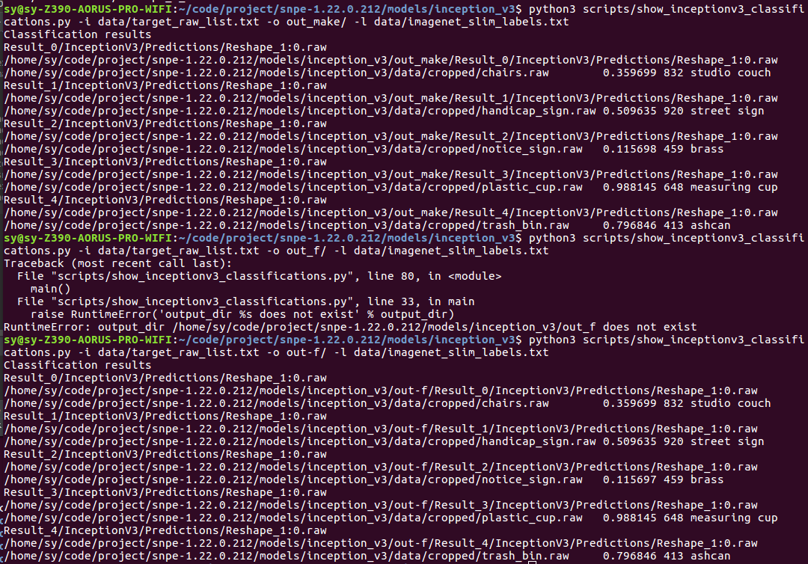

# 用NDK创建一个标准的交叉编译环境

    具体方法请自行百度、google
[编译包](https://pan.baidu.com/s/1UiNk6ZXswqvX_YQ1Ywlc5w)

# 编译源码成可执行文件
1.指定交叉编译工具：

    export CXX=home/sy/code/project/snpe-1.22.0.212/r13b_tool/bin/arm-linux-androideabi-g++
2.编译：
  修改Makefile.arm-android-gcc4.9文件 [Makefile](data/Makefile.arm-android-gcc4.9)
  
  
     export SNPE_ROOT=/home/sy/code/project/snpe-1.22.0.212 指定snpe路径
     make -f Makefile.arm-android-gcc4.9                    编译文件
3.把所 {需包} adb push 到板子中执行命令：

 
     adb push snpe-sample /system/bin/                                                                把可执行文件push bin文件中;
     adb push /home/sy/code/project/snpe-1.22.0.212/lib/arm-android-gcc4.9 /system/lib/               把所需库push lib文件夹中;
     adb push /home/sy/code/project/snpe-1.22.0.212/models/inception_v3 /sdcard/Download/inception_v3 把所需数据push 进 Download文件夹中 记得修改路径;
     adb shell                                                                                        进入板子中;
     cd /sdcard/Download/inception_v3/data/                                                           找到所需数据的根目录;
     snpe-sample -d ../dlc/inception_v3.dlc -i target_raw_list.txt  -o output                         执行命令;
     exit                                                                                             退出板子;
     adb pull /sdcard/Download/inception_v3/data/output ${SNPE-ROOT}/models/inception_v3              把结果返回，以查看显示;
4.借助 python show～.py 展示计算结果:

结果显示，在820板子和在pc机上无任何差别

     

     

