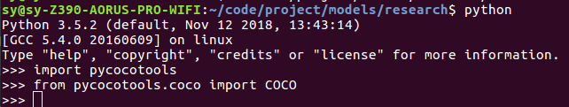
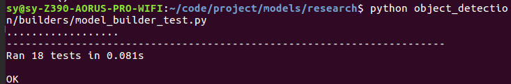

  1.clone ObjectAPI:
  
   官网（tf>1.9）[project](https://github.com/tensorflow/models.git) 老版本 [link](https://pan.baidu.com/s/1YNxuwPXom6riszzrbnVCrg)
    
  2.install dependencies
  
    `sudo apt-get install protobuf-compiler python-pil python-lxml python-tk`
    `pip install --user Cython`（需要翻墙）
    `pip install --user contextlib2`
    `pip install --user jupyter`
    `pip install --user matplotlib`
   
  3.coco API installation(若不用coco的可以不安装这个)
  
    git clone https://github.com/cocodataset/cocoapi.git
    cd cocoapi/PythonAPI
    make
    cp -r pycocotools <刚才下载的path>/models/research/
    
    验证：进入python3
    import pycocotools
    from pycocotools.coco import COCO
    无报错即可
    
   
    
    还是不行，可以执行如下命令
    cd coco/PythonAPI
    python3 setup.py build_ext --inplace
    python3 setup.py build_ext install
    
  4.Protobuf Compilation
  
    在<刚才下载的path>/models/research/执行
    wget -O protobuf.zip https://github.com/google/protobuf/releases/download/v3.0.0/protoc-3.0.0-linux-x86_64.zip
    unzip protobuf.zip
    ./bin/protoc object_detection/protos/*.proto --python_out=.
  5.Add Libraries to PYTHONPATH
  
    在<刚才下载的path>/models/research/执行 export PYTHONPATH=$PYTHONPATH:`pwd`:`pwd`/slim
    或者 sudo gedit ~/.bashrc 下面添加
    export PYTHONPATH=$PYTHONPATH:<刚才下载的path>/models/research:<刚才下载的path>/models/research/slim
    source ~/.bashrc
  6.测试：
      
    在<刚才下载的path>/models/research 执行
    python object_detection/builders/model_builder_test.py
   