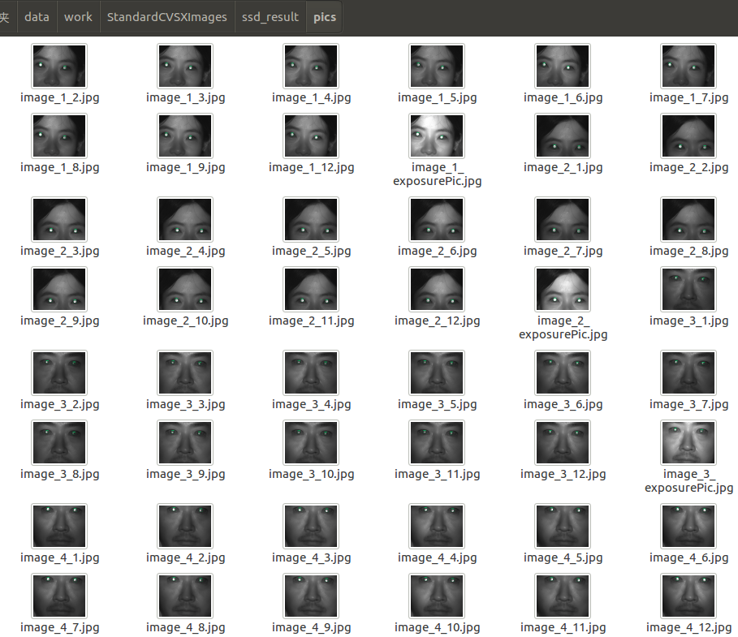

# convert .ckpt to .pb
     # From models/research/
     INPUT_TYPE=image_tensor
     PIPELINE_CONFIG_PATH={path to pipeline config file}
     TRAINED_CKPT_PREFIX={path to model.ckpt}
     EXPORT_DIR={path to folder that will be used for export}
     example:
     python object_detection/export_inference_graph.py --input_type=image_tensor --pipeline_config_path=/home/sy/code/project/models/research/object_detection/training/pipeline.config --trained_checkpoint_prefix=/home/sy/code/project/models/research/object_detection/training/model.ckpt-149244 --output_directory=/home/sy/data/work/StandardCVSXImages/log/
# test all the pic
 
     # from models/research/
     `python object_detection.py` 
   [code](../../../../object_detection.py)
 
# result

