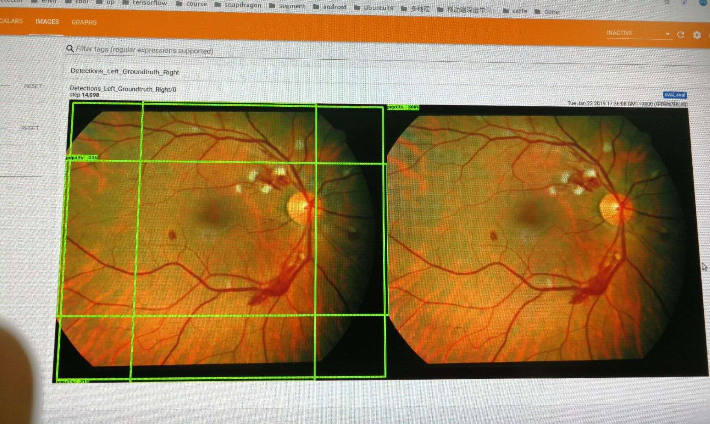

`os.chdir('/home/sy/code/project/models/research/object_detection/')`

# 新版本指令：

`python3 object_detection/model_main.py --pipeline_config_path=/home/sy/data/work/eye/ssd_mobilenet_v1_coco.config --model_dir=/home/sy/code/project/models/research/object_detection/training --num_train_steps=50000 --num_eval_steps=2000 --alsologtostder`

[config](data/pipeline.config)
## 可能遇到问题：

  1.
    ans：这是因为你的test数据量太少远远小于config 文件中的 num_example
       你应该做的是把 config文件中的 num_example:{the num of your test},不过显示这warning也没关系.
       
  2.csv转化到.record文件时，一定要用python3转换，用python2转换会出现意向不到的错误，最坑爹的是你不知道你转换的对不对，
    我是训练后看eval结果才发现的;
    
    
  3.正确输出界面显示：
  
   
   
# 旧版本指令：

      tips：旧版本训练，需要用tensorflow-1.6之下的版本，否则在snpe转化的时候，转化不过去（我在这做过很多重复工作）
`python legacy/train.py --logtostderr --train_dir=training/ --pipeline_config_path=/home/sy/data/work/StandardCVSXImages/ssd_mobilenet_v1_coco.config`

# tensorbord 实时查看loss

      tensorboard --logdir=taining

## 可能遇到问题：
1. Memcpy failed

ans1:
   
       reboot
      
ans2:
     
     import os
     os.environ['CUDA_VISIBLE_DEVICES']="1"
 
 
#result

##tensorboard show
`tensorboard --logdir=training`

## 官网时间
[link](https://github.com/tensorflow/models/blob/master/research/object_detection/g3doc/detection_model_zoo.md)
    
