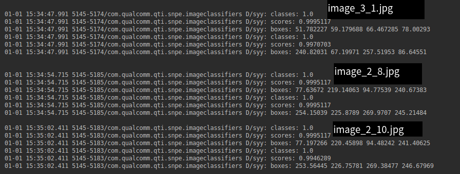

# convert .ckpt to .pb
  
    python3 object_detection/export_inference_graph.py --input_type=image_tensor --pipeline_config_path=/home/sy/code/project/models/research/object_detection/training/pipeline.config --trained_checkpoint_prefix=/home/sy/code/project/models/research/object_detection/training/model.ckpt-15432 --output_directory=/home/sy/data/work/StandardCVSXImages/log_old/

   tips: 因为snpe office 只支持到tf-1.6,而tf office 只有 tf-1.9之上的，需要用老版本训练，转化不能成功转化。[model](data/model.dlc)
   
# convert .pb to .dlc
  
     snpe-tensorflow-to-dlc --graph /home/sy/data/work/StandardCVSXImages/log_old/frozen_inference_graph.pb -i Preprocessor/sub 1,300,300,3 --out_node detection_classes --out_node detection_boxes --out_node detection_scores --dlc /home/sy/data/work/StandardCVSXImages/pupils_ssd.dlc --allow_unconsumed_nodes
# some change in office demo code
  ## 屏蔽权限
   1. permission question
  
   
   ans: 移走 ～/src/main/res/raw/inception_v3.zip，把改文件移动到chip中
         
    mv /home/sy/code/project/snpe-1.22.0.212/examples/android/image-classifiers/app/src/main/res/raw/inception_v3.zip <path>/inception_v3.zip
    tar -zxvf <path>/inception_v3.zip
    adb shell
    cd /storage/emulated/0/Android/data/com.qualcomm.qti.snpe.imageclassifiers/files/models
    mkdir inception_v3
    adb push <path>/inception_v3 /storage/emulated/0/Android/data/com.qualcomm.qti.snpe.imageclassifiers/files/models/inception_v3
      
   adb push:
   
   
     
   chip content:
   
   
    
   在com.qualcomm.qti.snpe.imageclassifiers.tasks.LoadModelsTask.java 64行 加
     `availableModels.add("inception_v3");` 
  
  ## 修改显示
  这个问题困扰好久（近一个月），还天真的以为官网的demo有bug，怎么没有显示，无知真可怕，最后app工程师出面解决，知晓一种语言是多么重要。
  其实很简单的修改显示设置：
  
    layout/fragment_model.xml 中长宽显示
  
  
  ## mobilenet_ssd specials
  [buildnet(code)](../../../../java/LoadNetworkTask.java)
  [code](../../../../java/LoadModelsTask.java)
  [logout(code)](../../../../java/ClassifyImageWithFloatTensorTask.java)
 
# snpe-net-run in linux host
1. create_raw file [code](../../../../scripts/create_ssd_raws.py)
 
    `python scripts/create_inceptionv3_raws.py -i data/ -d data/cropped/`
 
2. create_file_list [code](../../../../scripts/create_file_list.py)
 
    `python scripts/create_file_list.py -i data/cropped/ -o data/cropped/raw_list.txt -e *.raw`
3. snpe_net_run 

    add this line  `#Postprocessor/BatchMultiClassNonMaxSuppression add ` before  the raw_list.txt for ssd multiply output layer [raw.txt](pic/raw_list.txt)
    
   `snpe-net-run  --container dlc/model.dlc --input_list data/cropped/raw_list.txt --enable_cpu_fallback`
   
   
   for snpe didn't support all the layer in GPU,so you should add `--enable_cpu_fallback`
   
4.show the result [code](../../../../scripts/show_ssd_detection.py)
 
    
      python3 show_ssd_detection.py -i data/cropped/raw.txt -o output -l data/labels.txt

# result in 820 chip

    300*300像素，GPU运行时间大致40ms左右,无知太可怕，之前还以为高通的GPU并没有提升多少，现在才发现提升了小10倍，做技术重在多折腾。 

  

# accuracy compare between pc and chip

show on liunx_host
  
    由于snpe-tensorflow-to-dlc 默认保留权重8位，可能会有些损失，在300×300的图片显示，稍微偏一两个像素，我在显示的时候扩充了两个像素。

run on liunx_host

 
run on chip 

 
 
    从结果看，经过snpe_tensorflow_to_dlc转化的模型在识别精度上相差不到一个像素。