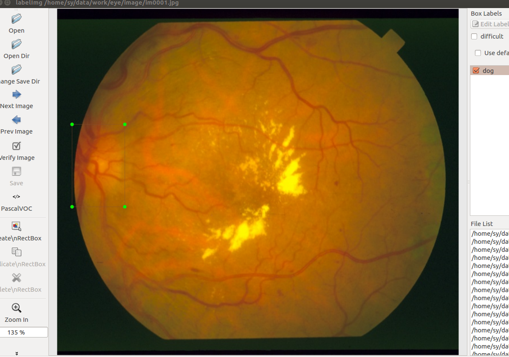
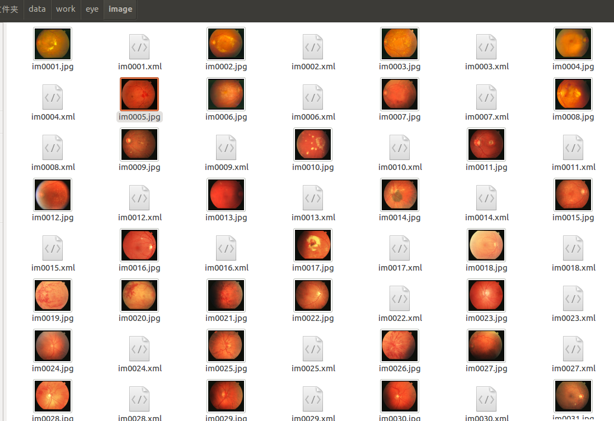
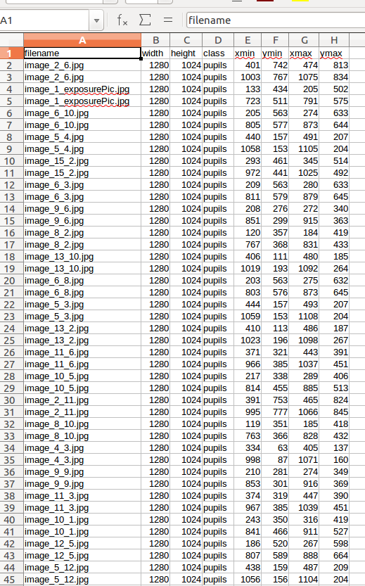

# labelImg annotation pic
 1.tool:[labelImg](https://github.com/tzutalin/labelImg)
   
     tips：学习下安装，快捷键可以达到事半功倍的效果。
   
 2.我的标注过程：
   
   我的标注结果：
   
# convert .txt convert to .xml
  `python txt_xml()` [code](../../../../trans.py)
# convert .xml to.cvs
   `python xml_csv()` [code](../../../../xml_to_csv.py)
   ##csv_result
   
# convert .csv to .record
  ``os.chdir('/home/sy/code/project/models/research/')``
   `--csv_input=data/tv_vehicle_labels.csv  --output_path=train.record ` [code](../../../../generate_tfrecord.py)
   
    tips:因为无法马上验证结果，一定要用python3转换{我花了两天时间才得出这个结论}