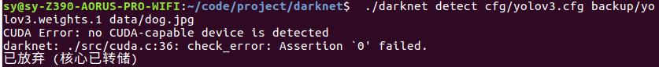
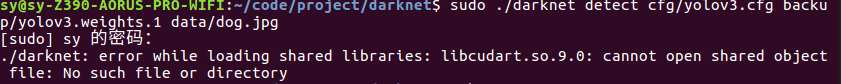

# 已放弃 (核心已转储)
1. CUDA Error: no CUDA-capable device is detected darknet: ./src/cuda.c:36: check_error: Assertion `0' failed.
  
  answer:[FYI](https://github.com/pjreddie/darknet/issues/98)
     
       sudo 执行
2.  error while loading shared libraries: libcudart.so.9.0: cannot open shared object file: No such file or directory
   
  answer2:[FYI](https://blog.csdn.net/layrong/article/details/38388703)
  
        export LD_LIBRARY_PATH=/usr/local/cuda-9.0/lib64/:$LD_LIBRARY_PATH

  
     
  
       