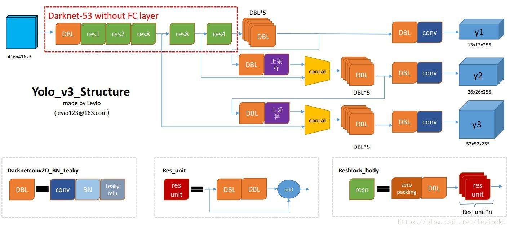

1. 根据官网指示来一遍[link](1.https://pjreddie.com/darknet/yolo/)
2. 用lableImg标注自己的数据，labelImg 的标注结果提供yolo(.txt)版本和voc(.xml)版本;
   .txt的标注结果如下[code(xml_txt)](../../../../transs.py)：
   
    | 类别 | 中心坐标x | 中心坐标y | 矩形框的长 | 矩形框的宽 |
    |:-----|:--------|:---------|:----------|:----------|
    |0     | 0.392708| 0.499219 |  0.110417 | 0.026562  |
    
       tips1:这些pic和label的文件路径下面要用;
       tips2:建立文件夹image（下保存pic和label）;建立文件夹label（下有label）{具体原因应该在darknet.c source code 中}
3. 修改makefile文件[makefile](data/Makefile)
    
       采用GPU训练（GPU比cpu快500倍）
       a:GPU=1
         CUDNN=1
         OPENCV=1
       b:根据个人显卡更改计算力
         ARCH= -gencode arch=compute_30,code=sm_30 \
         -gencode arch=compute_32,code=sm_32 \
         -gencode arch=compute_30,code=[sm_30,compute_30] \
         -gencode arch=compute_32,code=[sm_32,compute_32]  （你的N卡）
       c:更改nvcc路径
         NVCC=/usr/local/cuda-9.0/bin/nvcc （你的版本）
       d:更改cuda路径
          ifeq ($(GPU), 1) 
          COMMON+= -DGPU -I/usr/local/cuda-9.0/include/
          CFLAGS+= -DGPU
          LDFLAGS+= -L/usr/local/cuda-9.0/lib64 -lcuda -lcudart -lcublas -lcurand
          Endif （适配你电脑的型号）
         
4. 修改.config文件 [config](data/optic.cfg)

       需要修改的地方：
       1. 若测试：
         # batch=1
         # subdivisions=1
          若训练：
         # batch=64
         # subdivisions=8 （根据你N卡计算能力来）
       2.修改YOLO上面最近一个 [convolutional]中的filter=[class+5]*3 (共有三处)
       3.修改YOLO层中classes (共有三处)
5. 修改.names文件 [names](data/optic.names)
6. 修改.data文件 [data](data/optic.data) 转化 [code](../../../../transs.py) reuslt 文件[train test file](data/optic_train.txt)
7. [config 文件的参数说明](data/config.txt)
 
   也即yolo的网络结构：
   
8. 训练输出log解释：
  
  
  
9.常用指令参考：

       sudo ./darknet detect cfg/yolov3.cfg backup/yolov3.weights data/dog.jpg -thresh 0.00001
       sudo ./darknet detector train cfg/optic.data cfg/optic.cfg
       sudo ./darknet detector test cfg/optic.data cfg/optic.cfg backup/optic.weight data/im0001.jpg
       
10.测试结果 yolov3在检测方面比ssd效果要好的多，即使是yolov3-tiny

[yolov3-weigth-of-optic](https://pan.baidu.com/s/1bW_OAYYx7PUet1jI7BSsmQ)

[yolov3-result-of-optic](https://pan.baidu.com/s/1tMU4UMQGQsl591rgx4Owdg)

[yolov3-tiny-weight-of-optic](https://pan.baidu.com/s/1tMU4UMQGQsl591rgx4Owdg)

[yolov3-tiny-result-of-optic](https://pan.baidu.com/s/1tMU4UMQGQsl591rgx4Owdg)       
  
   

    
    
    
    