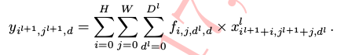
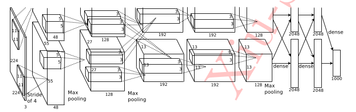
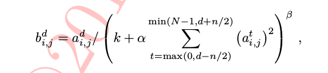
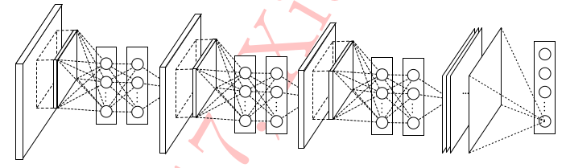
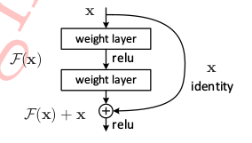
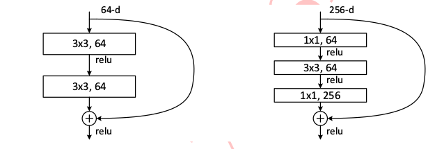

# 卷积神经网络的基本组件
## 卷积层
  
    卷积层是卷积神经网络种的基础网络，甚至在网络最后起分类作用的全连接层也是由卷积操作代替的;
    卷积操作是一种局部操作，通多一定大小的卷积核作用于局部图像区域获得图像的局部信息;
    事实上，卷积网路中的卷积核参数是通过网络训练学习到的，可以学到横向、纵向、任意角度、颜色、纹理、形状等众多模式的卷积核（滤波器），通过组合
    这些滤波器以及网络的后续操作，基本、一般的模式会逐渐被抽象为具有高层语义“概念”表示，并以此对应到具体的样本类别中。
   
     
     由上式可以看出，权重对不同位置的所有输入是一样的，这便是卷积层的“权值共享”，当然有时候还会在y上输入偏置项。在误差反向传播时可针对该层权重和偏置项分别设置随机梯度下降的学习率。
     当然根据实际情况，也可将某层偏置项设置为0,或者学习率设置为0,以起到固定该层偏置或权重的作用。
    
## 汇合层的功效
1. 特征不变性

       汇合操作使模型更关注是否存在特征而不是具体的位置; 
       使特征学习包含某种程度的自由度，能容忍一些特征微小的位移;
2. 特征降维

       汇合层的每个元素对应于原输入数据的一个子区域，因此汇合层相当于空间范围做了维度的约减，从而使得模型可以抽取更广泛的特征;
       减少下一层的输入大小，进而减小计算量和参数个数;
3. 防止过拟合

## 激活函数

    模拟了生物神经元特性：接受一组信号并产生输出，当神经元获得的输入信号累计效果超过一个阈值，神经元处于兴奋状态，否则抑制;
| 激活函数  | 缺点 |  优点  | 
|:--------|:-------|:-------| 
| sigmoid| "饱和效应"|可以模拟生物神经元受刺激过程|
|relu|    | 消除饱和效应  收敛速度加快|
             

## 全连接层

    如果说卷积层、汇合层和激活函数层等操作是将原始数据映射到隐层特征空间的话，全连接层则起到将学到的特征表示映射到样本的标记空间的作用。
  
## 目标函数

    目标函数的作用是用来衡量全连接层做出预测和真实样本标记之间的误差;
 |目标函数|应用范围 |
 |:-----|:-------|
 |交叉熵损失函数|分类问题|
 |l2损失函数|回归问题| 
 
 ## CNN网络中重要概念
 1. 感受野
 
 
    小卷积核通过多层叠加可取得与大卷积核同等规模的感受野，小卷积的优势：
    1. 通过多层叠加，加深了网络深度进而增强网络容量和复杂性;
    2. 增强网络容量的同时减少了参数的个数; 
       
 2. 分布式表示
 
    
    神经网络的“分布式表示”指：“语义概念”到“神经元”是一个多对多的映射：
    每个语义概念由许多分布在不同神经元中被激活的模式表示->对于某个模式，会有不同卷积核产生响应;
    每个神经元又可以参与到许多不同语义概念的表示中去->对于某个神经元，会在不同模式上产生响应;
 3. 深度特征的层次性
 
 
    浅层：基本模式，如边缘、纹理、形状等;
    深层：抽象模式，如车轮、文字、人脸等;
 ## CNN网络中典型结构
 
 1. Alex-Net
 
 
 
  重大贡献：
  
     
    1.alexnet首次将卷积神经网络应用于计算机视觉领域的海量图像数据集种，揭示了卷积神经网络拥有强大的学习能力和表达能力;
    2.利用GPU训练
    3.将一些训练技巧引入使“不可为”变“可为”，甚至“大有可为”：
      a：relu激活函数的使用;
      b：局部响应规范化(LRN)操作;
   
      
      c：为防止过拟合而引入的数据增广（data augmentation）和随机失活(dropout)  
    
 2.VGG
 
 贡献
 
 
    使用小卷积核“保持输入大小”等技巧;
 3.Network-in-Network
 
 
 
 重大贡献：
 
 
    1.提供了网络层间映射的一种新的可能性;
    2.增加了网络卷基层的非线性能力，将上层更多复杂性和非线性能力映射到下层;
    3.摈弃了全连接网络作为分类层的传统，转而改用全局汇合操作;
    
 4.残差网络
 
 神经网路的深度相比宽度在增加复杂性方面更有效，但也带来更大的问题：
 
 |深度增加带来的棘手问题|响应对策|
 |:------------|:----------:|
 |极易引起梯度“弥散” “爆炸”|特殊的权重初始化策略  批规范化策略|
 |训练误差没有降低反而升高|高速公路网络|
 
 
 
 瓶颈残差网络
 
 
 
 
    残差网络以全局平均汇合层替代了VGG网络结构中的全连接层：
    a：一方面可以使得参数大大减少;
    b：另一方面减少了过拟合的风险;
   
## 卷积神经网络的压缩
模型压缩：
  
   
    根据压缩过程对网络结构的破坏程度：
|类别|方法|基本介绍|操作流程|效果|评价 | 代表|
|:---|:-----|:-------|:-------|:------|:-----|:------|
|前端压缩|知识蒸馏  |"知识蒸馏"是迁移学习的一种 其目的是将一个庞大而复杂模型学到的知识; 通过一定的技术手段迁移到精简的小模型，使其性能相同;|何为“知识”，如何提取模型中的知识; 如何“蒸馏”，如何完成知识转移的任务;| |知识蒸馏作为前向压缩算法的一种补充，可以很好的知道小规模网络训练，但效果十分有限;|
| |紧凑的模型结构设计|设计更加紧凑的网络结构，并将这些新颖的结构运用到神经网络中去; 达到网络规模和精度之间一个平衡;| “挤压”：通过使用1×1的卷积对输入特征进行降维; “扩张”：使用部分1×1卷积来代替3×3卷积，为了使不同卷积核的输出能够拼接成一个完整的输出， 需要对3×3的卷积输入配置合适的填充像素; 使用多个分支捕捉不同的图像特征以达到扩充小模型多样性的目的 | | |FireModule; SqueezeNet|
| |滤波器层面的剪枝| 移除掉“不重要”的滤波器来减少对模型准确度的破坏;  数据驱动; 通道的稀疏度;  对损失函数的影响;  非结构化稀疏约束;  结构化稀疏约束; |1.衡量神经元的重要程度;  2.移除掉一部分不重要的神经元; 3.对网络进行微调; 4.返回第一步 |可将参数减少9～11倍|连接级别的剪枝太细，剪枝之后带来非结构化稀疏网络很难应用;  滤波器层面的剪枝太粗，很容易造成精度的大幅下降，同时保留下来的滤波器还存在一定的冗余; 结构化的稀疏方法以滤波器、通道、网络深度为约束对象; |
|后端压缩|低秩近似|将稠密矩阵由若干小规模矩阵近似重构|
|       |未加限制的剪枝| 连接级别的剪枝 |1.衡量神经元的重要程度;  2.移除掉一部分不重要的神经元; 3.对网络进行微调; 4.返回第一步|
|    |参数量化|所谓“量化”，是指从权重中归纳出若干“代表”， 由这些“代表”来表示某一类权重的具体数值;|  |即便是最简单的标量量化算法， 也能保持性能不受影响的情况下 模型大小减少8～16倍;  |参数量化能够以很小的性能损失实现模型体积的大幅下将， 不足：量化后的网络是“固定的”，很难再改变; 另一方面通用性差，往往一种量化对应一套专门的库  | 标准量化 乘积量化|
|    |二值网路|所有参数只能取正负1的极端情况;|权重二值化:一般直接根据权重正负； 计算二值权重的梯度：用Htanh(x)代替sign(x)|

    
 