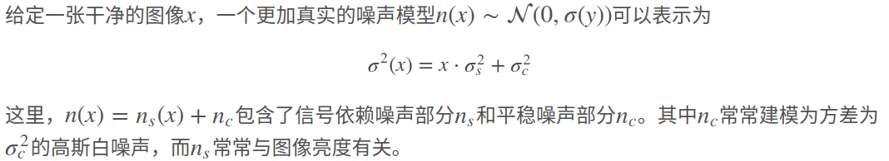
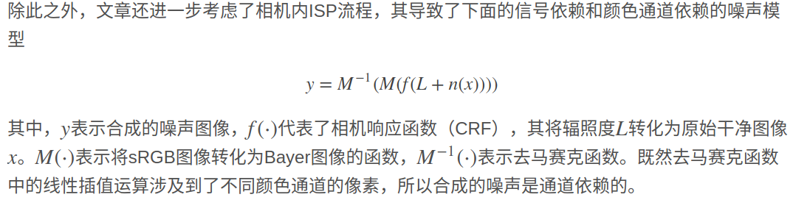
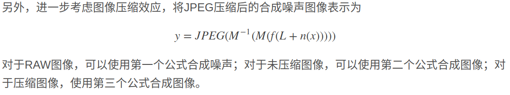
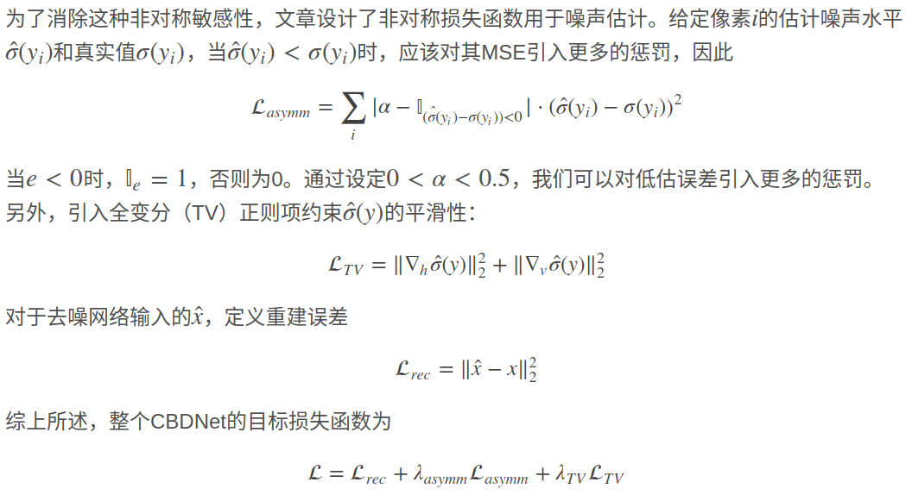
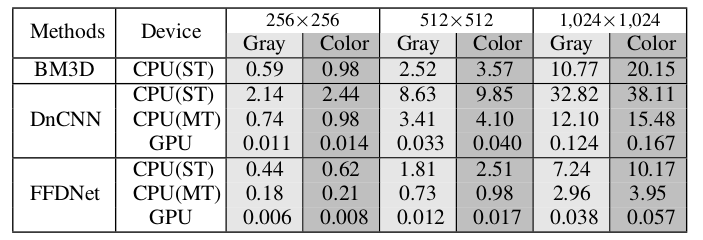

# 真实噪声模型
   1.真实噪声模型：
   
   2.考虑相机内ISP流程噪声：
   
   3.考虑图像压缩：
   
   

# 盲去噪和非盲去噪

    去噪：是最低级的图像处理y=x+v,通过各种方式去掉v,获得比较干净的图片;
    盲去噪：因为各种因素的影响，噪声的信息无法得到，在这种情况下去噪为盲去噪;
    非盲去噪：假定噪声的信息是可以获得的，在这种情况下的去噪为非盲去噪;

# 目前去噪方法

| 方法 |优点  |缺点 |代表 | 
|:----|:-----|:----|:----|
|模型去噪|能够灵活的去除不同水平的噪声|耗时;不能直接用于去除空间变异噪声;  并且需要手工制作先验图像和非局部自相似图像|BM3D  WNNM |
|判别器去噪| 从合成和真实数据集中学习到底层图像的先验和推理|缺少灵活性; 只能处理特定噪声水平的噪声  |DnCNN FFDnet CBDnet |

## CBDnet的主要贡献

    1.提出一个更加真实的噪声模型，考虑到信号独立噪声和相机内部噪声
    2.提出CBDnet模型，模型包括噪声估计子和非盲去噪子网络，从而可以实现图像的盲去噪;
    3.提出了非对称学习（asymmetric learning）的损失函数以应对因噪声等级低估而造成的影响（等级低估应该加噪声）
    4.将合成噪声和真实噪声图像一起用于网络训练，提升网络的去噪泛化能力;
    
## 损失函数

## 训练数据集
| 数据 | 作用 |
|:----|:-----|
|合成图像| 所有的损失函数都会被最小化以更新CBDnet |
|真实图像| 仅训练重建误差和正则项|

## 运行时间
| 项目| 平台 | 时间 | 图像尺寸 | 
|:---|:----|:----:|:-------|
| CBDnet   | 1080ti | 0.4s|512*512|
| FFDnet | i7 TitanX  | |