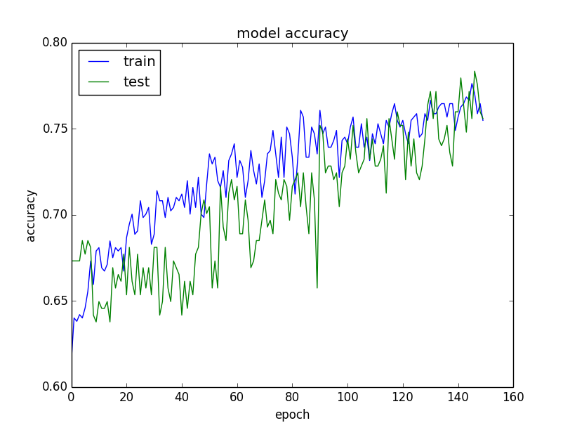

# 对深度学习的理解

      起始于一个较为通用的多层次特征提取的神经网络分类模型，依靠足够多的经过标注的样本数据，通过随机梯度下降方法，正反向反复迭代，确定大量的可调整参
    变量——权值，把高维度复杂非线性问题近似为足够多通过参变量限制的较低维非线性问题的叠加，把整体高阶转为多参量低阶。这样形成的数学形态，能够和整个样
    本数据有最好的拟合。                                                                                                ----某院士
# 根据任务对图像的理解（cnn）

## 分类

      将图像结构化为某一类别的信息，用事先确定好的类别或者实类来描述图片。这一任务是最简单，最基础的图像理解任务，也是深度学习模型最先取得
    突破和实现大规模应用的领域任务。关心整体。
## 检测
 
      关注特定物体目标，要求同时获得这一目标的类别信息和位置信息。相比分类，检测给出的是对图像前景和背景的理解，我们需要从背景信息种分离
    出感兴趣的目标，并确定这一目标的描述（类别和位置），因而，检测模型的输出是一个列表，列表的每一项使用一个数据组给出检出目标的类别和位置。
## 分割

      分割包括语义分割和实例分割，语义分割是对前景分离的扩展，要求分离开具有不同语义的图像内容（如姿态估计）;后者是检测任务的扩展
    要求描述出较为精细的目标轮廓，分割出像素级别的（如医疗领域的血管分割，自动驾驶领域的道路和行人的分割）

# 深度学习中benchmark网络分类
## repeat
  
     由AlexNet和VGG开拓，被几乎所有的网络采用。即堆叠相同的拓扑结构，整个网络成为模块化的结构。
## multi-path

     由inceptipn系列发扬，将前一层的输入分割到不同的路径上进行变换，最后拼接结果。
## skip-connection
  
     最初出现HighwayNetwark,由ResNet发扬并成为标配，即建立深层信息和浅层信息的传递通道，改变原有的单一线性结构。

总结：     

# 深度学习中性能提升诀窍

## 从数据性提升性能

1 .  收集更多的数据

  

 
2.产生更多的数据

       如果你的数据是数值型的向量，那么随机生成已有向量的变形向量;
       如果你的数据是图像，那么随机的生成相似图像;
       如果是文本
      
 [深度学习中的图像数据扩充](https://machinelearningmastery.com/image-augmentation-deep-learning-keras/)

3.对数据做缩放

       法宝：将数据缩放到激活函数的阈值范围
    |激活函数| 缩放范围 |
    |:------:|:---------:|
    |sigmoid|0~1|
    |tanh|-1~1|
    |softmax|标准化|
    
4.对数据做变换

   猜测每一列数据的分布：
    
       这一列数据是不是倾斜的高斯分布，若如此，尝试用Box-Cox方法纠正倾斜;
       这一列数据是不是指数分布，若如此，则进行对数变换;
       这一列数据是不是存在某种特性，若很难发现，尝试一下对数据平方或者开方;
       是否可以将特征离散化，以便更好的强调一些特征;
       
   尝试下面几列方法：
      
       是否可以用投影的方法进行预处理，如PCA;
       是否可以将多个属性值合并为单个属性值;
       是否可以发掘某个新的属性，用布尔值表示;
       是否可以在时间尺度上或者是其他维度上有新的发现;
5.特征选择

   如果时间允许，建议在相同的神经网络模型上尝试多个方法：
   
       也许更少的特征也恩该拿得到同样的、甚至更好的效果;
       也许所有的特征选择方法都选择抛弃同一部分特性属性。那真的应该好好看看这些特征了;
       也许选出的这部分特征给你带来新的启发，构建出更多的新特征。
6.问题重构
   回到问题的定义上来：
     
       也许你可以将时间元素融入到一个窗口之中;
       也许你可以将分类问题转换成回归问题，反之亦然;
       也许你可以把二值类型的输出转化为softmax输出;
       也许你可以对子问题建模。     
##  从算法上提升性能
1. 算法的筛选

       尝试一些线性的算法，逻辑回归和线性判别分析;
       尝试一些树模型，CART、随机森林和梯度提升;
       尝试SVM和KNN等;
       尝试其他的神经网络，CNN，LSTM等;
2. 文献中学习
3. 重采样
   
       也许你只是简单地把数据分为训练集和测试集。如果是这样，就需要保证切分后的数据分布保持不变。单变量统计和数据可视化是不错的方法;
       也许你们可以扩展硬件来提升效果。举个例子，如果你有一个集群或是AWS的账号，我们可以并行训练n个模型，然后选用它们的均值和方差来获取更稳定的效果;
       也许你可以选择一部分数据做交叉验证（对于early stopping非常有效）;
       也许你可以完全独立地保留一部分数据用于模型的验证;
       也许可以让数据集变得更小，采用更强的重采样方法。
## 从算法调优上提升性能
1. 模型可诊断性

       牢记：模型不是处于过拟合，就是处于欠拟合
     绘制图表
     
      
       
       如果训练集的效果好于验证集，说明可能存在过拟合的现象，试一试增加正则项;
       如果训练集和验证集的准确率都很低，说明可能存在欠拟合，你可以继续提升模型的能力，延长训练步骤;
       如果训练集和验证集的曲线有一个焦点，可能需要用到early stopping的技巧了;
       
     研究模型的正确预测和错误预测样本：
          
       也许你需要更多的难预测的样本数据;
       也许你可以从训练集中删去那些容易被学习的样本;
       也许你可以有针对性地对不同类型的输入数据训练不同的模型;
2. 权重的初始化
   
   一条经验规则：用小的随机数初始化权重。
   
       尝试所有的初始化方法，找出最好的一组初始化值;
       试一试用非监督式方法预学习，比如自动编码机;
       尝试用一组现有的模型权重参数，然后重新训练输入和输出层（迁移学习）;
    记住，修改权重初始化值的方法与修改激活函数或者目标函数的效果相当
3. 学习率

       尝试非常大、非常小的学习率;
       根据参考文献，在常规值附近用网格化搜索;
       尝试使用逐步减小的学习率;
       尝试每隔固定训练步骤衰减的学习率;
       尝试增加一个向量值，然后用网格搜索;
       大的网络模型需要更多的训练步骤，反之亦然。如果你添加了更多的神经节点和网络层，请加大学习率;
       学习率与训练步骤、batch大小和优化方法都有耦合关系;
4. 激活函数
  
       relu;
       sigmoid;
       tanh;
5. 网络结构
 
       试一试加一层有许多节点的隐藏层（拓宽）;
       试一试一个深层的神经网络，每层节点较少（纵深）;
       尝试将上面两种组合;
       尝试模仿近期发表的问题类似的论文;
       尝试拓扑模式和书本上的经典技巧;
6. batch 和 epoch

   batch大小决定类梯度值，以及权重更新频率;
   一个epoch指的是训练集的所有样本都参与一轮训练，以batch为序;
   深度学习模型常用小的batch和大的epoch以及反复多次训练;
    
       尝试将batch大小设置为全体训练集的大小（batch learning）;
       尝试将batch大小设置为1（online learning）;
       用网格搜索尝试不同大小的mini-batch（8，16，32，…）;
       尝试再训练几轮epoch，然后继续训练很多轮epoch;
       
7. 正则项
    
    正则项是克服训练数据过拟合的好方法;
    
       权重衰减来惩罚大的权重值;
       激活限制来惩罚大的激活函数值;
8. 优化方法和损失函数

       adam;
       RMSprop;
    
9. early stopping

## 用融合方法提升效果

1. 模型融合
2. 视角融合
3. stacking
       