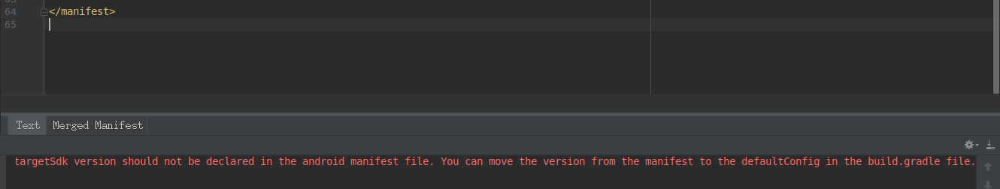
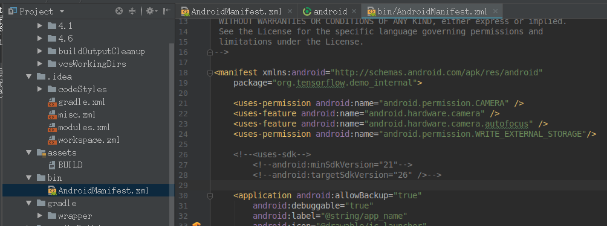
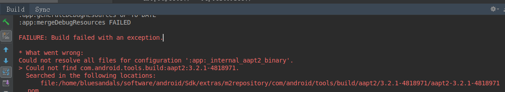
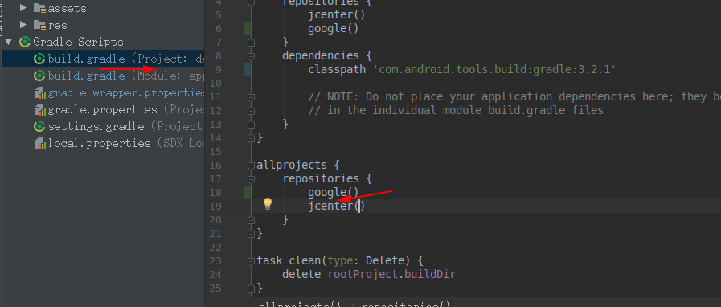
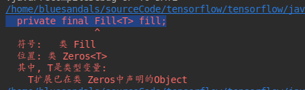

# 导入常见问题
1. You can move the version from the manifest to the defaultConfig in the build

answer:

2. Could not find com.android.tools.build:aapt2:3.2.1-4818971.

answer:

3. 错误: 找不到符号private final Fill<T> fill;

     
     
answer:

     `set to 'bazel', 'cmake', 'makefile', 'none'
      def nativeBuildSystem = 'none'`
    [FYI](https://github.com/tensorflow/tensorflow/issues/21431)