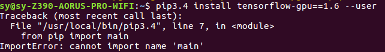
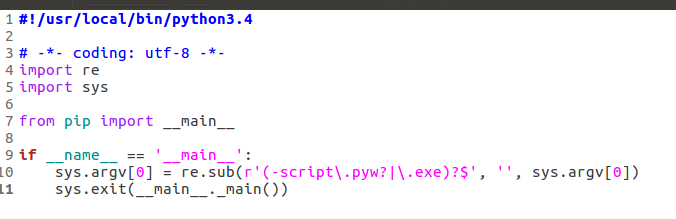
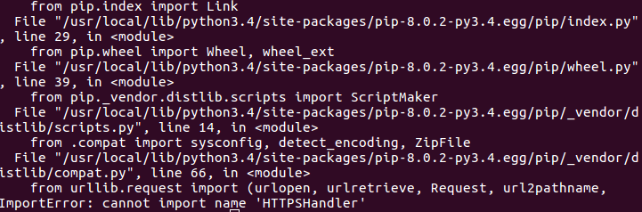
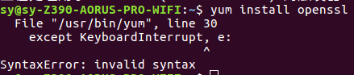

# 温馨提示：
1. 一定不要处女党，喜欢删除自己不知道功能的文件（除了/home 之外的所有文件）
2. 一旦系统崩溃，立马用个启动U盘识别系统，然后用另一个U盘把重要文件copy出来。

# 常见问题

1. pip question:
  
   error1:  ImportError: No module named 'pip._internal'
   
   执行pip3：
    
        import: not authorized `sys' @ error/constitute.c/WriteImage/1028.
        from: can't read /var/mail/pip
        /usr/bin/pip3: 行 11: 未预期的符号 `main.main' 附近有语法错误
        /usr/bin/pip3: 行 11: `    sys.exit(main.main())'
   ans:
       
       curl https://bootstrap.pypa.io/get-pip.py -o get-pip.py
       python3.5 get-pip.py --force-reinstall`
   
   error2:ImportError: cannot import name 'main'
    
    
    
    ans:
    
         sudo gedit /usr/local/bin/pip3.4
         
         
      修改为：
      
   
       
2. Ubuntun16.04下安装python3.4

      a: [download](https://www.python.org/ftp/python/3.4.2/Python-3.4.2.tgz)
      b: install
      
          tar -xzvf Python-3.4.2.tgz
          cd Python-3.4.2
          ./configure --enable-shared
          make
          sudo make install
      c: config python3.4 (may need)
      
         sudo rm /usr/bin/python
         sudo ln -s /usr/local/Python/Python3.4.2/python /usr/bin/python   
      d: 错误 E: Sub-process /usr/bin/dpkg returned an error code (1)
      
        cd /var/lib/dpkg
        sudo mv info info.bak
        sudo mkdir info
        
3. 安装与python对应的pip：

       由于项目需要，必须用python3.4,这时候需要修改与之对应的pip版本，不过按着 1 安装，一直提示找不到制定版本。索性重新安装下与python对应的pip：
 
    a：install setuptools [wget --no-check-certificate ](https://pypi.python.org/packages/source/s/setuptools/setuptools-19.6.tar.gz#md5=c607dd118eae682c44ed146367a17e26)
      
       tar -zxvf setuotools
       cd setuptools-19.6
       python3.4 setup.py build
       python3.4 setup.py install
       若缺少什么包，重新安装后需要 cd python; make & make install; cd setuptool ...
       
    b:install pip [wget --no-check-certificate](https://pypi.python.org/packages/source/p/pip/pip-8.0.2.tar.gz#md5=3a73c4188f8dbad6a1e6f6d44d117eeb)
    
       tar -zxvf pip-8.0.2.tar.gz
       cd pip-8.0.2
       python3.4 setup.py build
       python3.4 setup.py install
       
    c:测试 一般容易出现`ImportError: cannot import name 'HTTPSHandler'
     
     
     继续搜网上很多说是用yum 安装 openssl openssl-dev,接下来就没有接下来了
     
     error1：python 版本错误
     
     
     
       因为yum是python2写的，在对应位置修改成python2.7
     
     error2：Ubuntu 内核与yum冲突
     
         sudo apt-get install openssl
         sudo apt-get install openssl-dev
         重新编译python
      
     

