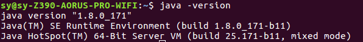

# jdk config
 ## download
 [download](https://pan.baidu.com/s/1Ebn6SwcmCuiCQBiidynZ_Q)
 
 ## config
 
    
        export JAVA_HOME=/home/sy/software/jdk1.8.0_171
        export JRE_HOME=${JAVA_HOME}/jre
        export CLASSPATH=.:${JAVA_HOME}/lib:${JRE_HOME}/lib
        export PATH=${JAVA_HOME}/bin:$PATH
 
 ## test
 
     java -version 
  
  
# android_studio install
 ## download
 
 [download](https://pan.baidu.com/s/117ErRXeOed_akn28EDoW0Q)
 
 ## install 
 
     闭着眼睛搞到黑，可能需要翻墙。使用过程遇到好多问题，浪费好多时间，请移步 
  [android_FAQ.md](../FAQ/android_FAQ.md)
 