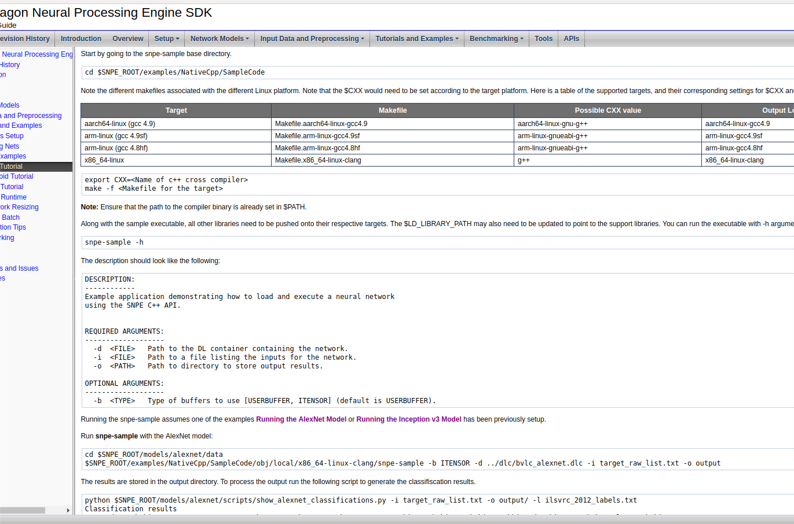

# 重写 cmakelist

    为了方便调式程序，我选择在clion下写cmakelist.txt 文件
  [CMakeList.txt](file/CMakeLists.txt)
  
# use guide
1. 该部分功能类似snpe-net-run，具体用法可参考

2. [code]()
3. 改写显示 [code](https://pan.baidu.com/s/1uiHQHn2iMcEKW1l-dbyONw)