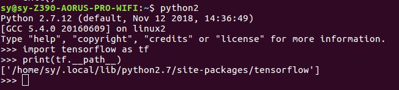
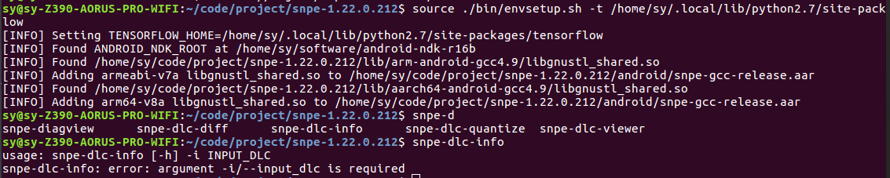

   # download
   [download](https://developer.qualcomm.com/software/qualcomm-neural-processing-sdk) 
   # setup SDK
   
     sudo apt-get install python-dev python-matplotlib python-numpy python-protobuf python-scipy python-skimage python-sphinx wget zip
     source ~/snpe-sdk/bin/dependencies.sh
     source ~/snpe-sdk/bin/check_python_depends.sh
     
   # config SDK
   
     sudo gedit ~/.bashrc
     export export ANDROID_NDK_ROOT=/home/sy/software/android-ndk-r16b
     source ~/.bashrc
     
   # config snpe to tensorflow
   
     cd ~/snpe-sdk/
     source ./bin/envsetup.sh -t  /home/sy/.local/lib/python2.7/site-packages/tensorflow
     
   if you didn't know the path of tensorflow, you can run the commond
   
     python2
     import tensorflow as tf
     print(tf.__path__)
     
   
   
   # test
   
    you can run either of snpe-* commond to test,such as:
   
    
     tips: snpe only support python2.7 or python3.4, must be care.