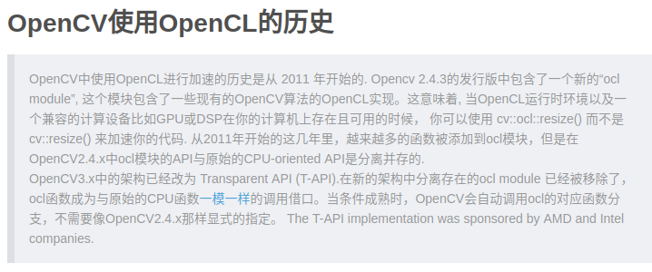

# install opencv in liunx
[链接]([code](https://blog.csdn.net/cocoaqin/article/details/78163171))
1. download 
   [sources](https://opencv.org/releases.html)  下载 3.4版本的Sources
2. 编译

  
     tar -zxvf opencv-3.4.5.zip
     cd opencv-3.4.5
     mkdir build
     cmake -D CMAKE_BUILD_TYPE=Release -D CMAKE_INSTALL_PREFIX=/usr/local ..
     sudo make 
     sudo make install
     
3.配置 

     sudo gedit /etc/ld.so.conf.d/opencv.conf 此时是空的，写进入 /usr/local/lib  //将opencv库添加到路径，从而可以让系统找到
     sudo ldconfig  //使上述配置命令生效
     sudo gedit /etc/bash.bashrc //配置bash 在末尾添加如下命令
      
          PKG_CONFIG_PATH=$PKG_CONFIG_PATH:/usr/local/lib/pkgconfig 
          export PKG_CONFIG_PATH 
     
     source /etc/bash.bashrc  //使bash配置生效
     sudo updatedb           //更新
     
4.guide：
   
   
        cd opencv-3.4.0/smaples/cpp/example_cmake 
        sudo gedit CMakeLists.txt //可以模仿改文件写 CMakeList.txt
        
# 眼底相机cfc code 移植到820 
1.移植环境搭建：

2.code：
  
  openMP [cmakelist](file/CMakeLists.txt)
 
  openCL [envir](file/main.cpp)
  
    
    
      
     启动OCL模块主要步骤：
     1.注册全局OpenCL设备;
     2.把内存的数据上传到显存;
     3.在OpenCL设备上进行计算;
     4.把显存的数据下载到内存;
     5.在host上进行剩余的运算;
      
     运用OCL几个注意事项：
     
     TIP1：尽量减少在opencl函数调用之间加入数据传输指令，这是因为上传下载操作会严重影响核函数在命令队列上的调度，尤其是下载操作;
        这个操作被设计成同步指令。有的函数有隐式的下载调用，比如cv::ocl::sum,应尽量调整其执行顺序，必要的时候使用AMD CodeXL
        蓝下命令队列的执行密度;
     TIP2：目前OCL模块编译速度要比CUDA模块快很多，但运行时，OCL模块在函数第一次调用时会有明显的延迟，但CUDA没有，因为CUDA模块在OpenCV
        编译会把核函数编译成cubin文件，这样运行时不会出现延时启动现象;因为OpenCL，我们不能在OCL函数运行前旧确定核函数的编译选项和目标
        运行平台，因此只能在运行时进行核函数编译，作为一个补救措施，我们加入一个功能，OCL在第一次运行时把这以此编译好的核函数二进制保存到磁盘，
        这样第二次旧避免了编译造成的启动延时。
        
  
  cfc [code](https://pan.baidu.com/s/1CgO-R5d0sF4I2Nlq4MTzRA)

3.result
 
 
    图的尺寸为1280×1024;
  
  |  items  | refine | gussian opencv |  
  |:--------|:-------|:---------------|
  |no acce  | 450ms| 570ms |
  |OpenMP|  350ms| 350ms |
  |OpenCL| 经验证无效 |  经验证无效|  
  
  
     
     待验证，用UMat的方式验证测试时间;

# cvs 移植 到 820 芯片的运行结果：

  
  |  items  | tradition location | ssd location | cvs-rewrite| 
  |:--------|:-------|:---------------|:----------|
  |饱和度评估并保存      | 70ms| 450ms |100ms|
  |同时运行6张图片并保存  | 400ms|1.6s  |600~800ms|
  |饱和度评估未保存       | 20ms| 350ms |80ms|
  |同时运行6张图片未保存  | 150~200ms|600~800ms|550~600ms|
  
   
    可提升空间：保存snpe所需数据（60ms）;建立网络（），计算{GPU}（40+ms）

  
     

     
 
     